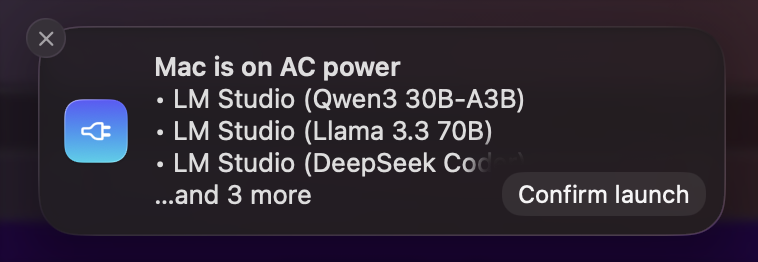
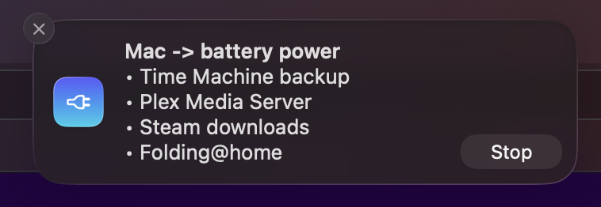

<h1>
	 PlugWatch
</h1>

A macOS background service that **power-gates local apps**: it starts and stops configured targets
depending on whether the MacBook is on **AC power or battery**, asking first through an **actionable
system notification** — one button to confirm, closing it to decline.

## 💡 Why

Some work is only worth doing on mains power. PlugWatch keeps the heavy things off your battery: it
watches the power source, and asks before starting or stopping them.

### For a local-AI and agentic setup

- A **local LLM server** (LM Studio, Ollama) pins the GPU — on battery it drains fast, runs hot and
  spins the fans.
- **Overnight collection and indexing** — memory and context systems (Hindsight), code graphs
  (graphify), curated knowledge bundles (OKF), embeddings — all rebuild while you sleep, on mains
  power, driving a **local** model. That's the expensive half of an agentic workflow run for free
  instead of metered API tokens.
- Work all day with a cloud agent (OpenCode, Claude Code, Codex, etc.) and let the local indexer
  pick up the slack at night. The two never fight for the machine, and the metered one never runs on
  your battery.

### For everything else

Anything with a start command and a stop command works — PlugWatch is not AI-specific:

| What you run                                  | Why it should wait for the wall socket    |
| --------------------------------------------- | ----------------------------------------- |
| Photo library analysis (Photos, Lightroom)    | hours of scanning faces and objects       |
| Time Machine and large backups                | sustained disk and network                |
| Media transcoding (Plex, Jellyfin, HandBrake) | saturates the CPU on purpose              |
| Distributed computing (Folding@home, BOINC)   | designed to use every core                |
| Docker containers and VMs                     | you don't want them waking up in your bag |
| Game downloads and updates (Steam)            | tens of GB of disk and network            |
| Transcription jobs (Whisper)                  | long CPU bursts after recording           |

---




## Behaviour

- 🪫 **Hysteresis** — a brief unplug/re-plug cannot thrash: the new state must _hold_ for the
  configured delay before anything is offered.
- 🔁 **One prompt per transition** — every _stable_ power change asks; steady state never
  repeats. Whether your apps are actually running cannot be known for certain, so PlugWatch asks
  instead of assuming. Dismissing means "not this time" and won't re-ask until power changes again.
- 🕗 **activeHours** — outside the window it never auto-starts (stopping on battery still applies).
- 🎛 **Same prompt at startup** — coming up asks the same question the current power state implies,
  so every notification has one shape: `Mac → AC power` (or `Mac → battery power`), the affected
  apps as a bulleted list, and a single button — `Confirm launch` or `Stop`.
- 🔔 **Stop notice** — an instant notification when the service stops.
- 🤫 **`mode: auto`** — skip the asking entirely: act silently on each transition, with no prompts.
- 🛟 **Graceful degradation** — a missing helper or denied permission is logged, never a crash.

---

## 📋 Requirements

|          |                                                                                    |
| -------- | ---------------------------------------------------------------------------------- |
| OS       | macOS (Apple Silicon or Intel) — launchd and UserNotifications are required        |
| Node     | ≥ 22 for the published CLI; ≥ 24 only if you run the TypeScript sources directly   |
| Compiler | Xcode command line tools (`swiftc`) — needed once to build the notification helper |

## 📦 Install

```bash
npm install -g plugwatch
plugwatch init          # writes a starter config.json into the data directory
plugwatch install       # builds the notification helper and installs the LaunchAgent
```

`plugwatch status` prints the exact config path. By default it is
`~/Library/Application Support/plugwatch/config.json`; set `PLUGWATCH_HOME` to relocate everything
(config, logs, helper).

## ⚙️ Configuration

Edit the `config.json` reported by `plugwatch status` (a starter file is written by
`plugwatch init`; see [`config.example.json`](config.example.json) for the annotated original).
Nothing is hardcoded — model ids and app paths belong there, not in the code.

### Field reference

| Field                        | Meaning                                                                                                                                                                                     |
| ---------------------------- | ------------------------------------------------------------------------------------------------------------------------------------------------------------------------------------------- |
| `mode`                       | `ask` (default) notifies before acting; `auto` acts silently on each transition, with no prompts. An unknown value is rejected rather than defaulted.                                       |
| `pollSec`                    | How often to read the power state. Default `60`.                                                                                                                                            |
| `notifications.system`       | Post actionable notifications. Default `true`.                                                                                                                                              |
| `delay.acSec`                | Seconds AC must hold before offering to start. Default `120`.                                                                                                                               |
| `delay.batterySec`           | Seconds battery must hold before offering to stop. Default `60`.                                                                                                                            |
| `activeHours.start` / `.end` | Local-time window (0–23). Omit to disable. Wraps past midnight.                                                                                                                             |
| `targets[].id`               | Stable key, used in logs and notifications.                                                                                                                                                 |
| `targets[].label`            | Display name; defaults to `id`.                                                                                                                                                             |
| `targets[].bin`              | Optional binary override. Accepts `~`. Commands whose first element matches its basename are rewritten to this path; others (`pkill`, …) resolve on `PATH`. `lms` and `ollama` auto-detect. |
| `targets[].start` / `.stop`  | Ordered list of commands; each is `[cmd, ...args]`. Executed in order, **fail-fast** — the first failure aborts the rest of that sequence.                                                  |
| `targets[].detached`         | Spawn this target's start commands detached and don't wait (long-running daemons such as `ollama serve`).                                                                                   |
| `targets[].env`              | Extra environment variables for this target's commands.                                                                                                                                     |
| `targets[].timeoutMs`        | Per-target command timeout. Defaults: 180000 start, 60000 stop.                                                                                                                             |
| `targets[].enabled`          | Set `false` to keep a target configured but inactive.                                                                                                                                       |

## 🎛 CLI

| Command                         | Effect                                                                    |
| ------------------------------- | ------------------------------------------------------------------------- |
| `plugwatch start`               | Start the watcher in the background (no-op if already running).           |
| `plugwatch stop`                | Stop every running watcher.                                               |
| `plugwatch restart`             | Stop then start.                                                          |
| `plugwatch status`              | Running state, power state, and configured targets.                       |
| `plugwatch logs`                | Follow the watcher log.                                                   |
| `plugwatch init [--force]`      | Write a starter `config.json` in the data directory.                      |
| `plugwatch install`             | Build the notification helper and install the LaunchAgent.                |
| `plugwatch uninstall [--purge]` | Remove the LaunchAgent (`--purge` also deletes config and runtime state). |
| `plugwatch help`                | Usage.                                                                    |

### Flags

| Flag                     | Effect                                                                                         |
| ------------------------ | ---------------------------------------------------------------------------------------------- |
| `--status`               | Same as the `status` command.                                                                  |
| `--once`                 | Evaluate once and act immediately (no hysteresis).                                             |
| `--simulate ac\|battery` | Pretend the machine is on that power source.                                                   |
| `--no-notify`            | Skip the notification and assume "yes" (testing).                                              |
| `--purge`                | With `uninstall`: also delete config and runtime state.                                        |
| `--force`                | Run even if a watcher is already running; with `init`, overwrite an existing config.           |
| _(no command)_           | Run the watcher loop in the foreground (what launchd runs). Refuses if one is already running. |
| `-h`, `--help`           | Usage.                                                                                         |

Exit codes: `0` ok, `1` runtime error, `2` usage error.

## 🧪 Testing without unplugging

```bash
plugwatch --once --simulate ac --no-notify       # start targets, no prompt
plugwatch --once --simulate battery --no-notify  # stop targets, no prompt
plugwatch --once --simulate ac                   # with the real notification
plugwatch --once                                 # one evaluation of the real power state
```

## 📦 Install as a service

```bash
plugwatch install                # builds the helper, writes ~/Library/LaunchAgents/, starts it
plugwatch uninstall              # stops and removes the agent (keeps config + logs)
plugwatch uninstall --purge      # also removes config.json and runtime state
```

The agent is `com.plugwatch.agent`, with `RunAtLoad` and `KeepAlive`. Because it is kept alive,
`plugwatch stop` boots it out; `plugwatch start` (or a login) brings it back.

## 🩺 Troubleshooting

| Symptom                                                  | Fix                                                                                                                                                                                                             |
| -------------------------------------------------------- | --------------------------------------------------------------------------------------------------------------------------------------------------------------------------------------------------------------- |
| No notification appears, log says `UNErrorDomain Code=1` | The bundle isn't registered with LaunchServices yet — `plugwatch install` does it; also allow **PlugNotify** in System Settings → Notifications.                                                                |
| `helper not found`                                       | Run `plugwatch install` (it rebuilds the helper).                                                                                                                                                               |
| Permission was denied once                               | System Settings → Notifications → **PlugNotify** → allow.                                                                                                                                                       |
| `launchctl` exit 78 / `EX_CONFIG`                        | Paths in the plist must be absolute (launchd expands neither `~` nor `$HOME`). Re-run `plugwatch install`.                                                                                                      |
| Prompts too often on flapping power                      | Increase `delay.acSec` / `delay.batterySec`.                                                                                                                                                                    |
| `lms load` no-ops                                        | Confirm the model id with `lms ls`; it changes between LM Studio versions — keep it in `config.json`.                                                                                                           |
| Notification icon is blank after changing it             | `usernoted` caches the icon per bundle id. Rebuild, then `lsregister -f PlugNotify.app && killall usernoted NotificationCenter`.                                                                                |
| `start` says started, then `stop` says already stopped   | A watcher from an older version is lingering; `plugwatch stop` then `plugwatch start`.                                                                                                                          |
| Clicking a notification button does nothing              | It's a stale notification from a previous run. Current runs withdraw old ones automatically; `plugwatch restart` clears any leftovers.                                                                          |
| The prompt vanishes after a few seconds                  | That's the macOS **banner** style — prompts have no timeout, so the watcher is still waiting and the notification stays in Notification Center. Set PlugNotify to **Alerts** to keep it on screen.              |
| A prompt keeps reappearing every few seconds             | It shouldn't: dismissing one silences that power state until power changes again.                                                                                                                               |
| Leaving a prompt open stopped new ones appearing         | It shouldn't: a newly settled transition supersedes the open prompt instead of waiting for it.                                                                                                                  |
| A power change didn't prompt                             | A previously open prompt used to queue it behind itself. Now a newly settled transition withdraws it and asks immediately — if you still see this, check `plugwatch logs` for `withdrawing the pending prompt`. |
| `stop` didn't unload the model                           | `stop` steps run best-effort, so a failing first command can't skip the rest. Check `plugwatch logs` for the actual command output.                                                                             |
| `plugwatch is already running (pid …)`                   | Expected. Run `plugwatch stop` first, or `--force` to run a second watcher anyway — but two watchers delete each other's notifications, so don't.                                                               |

## 🛠 Development

```bash
pnpm install        # dependencies into node_modules
pnpm build          # tsc -> dist/ (the published artifact)
pnpm dev            # run the watcher in the foreground from source
pnpm test           # vitest
pnpm typecheck      # tsc --noEmit
pnpm lint           # oxlint (type-aware)
pnpm format:style   # oxfmt
pnpm build:notify   # Swift helper -> PlugNotify.app
```

`npm publish` runs `prepublishOnly` (lint → typecheck → test → build) first, so `dist/` is always
fresh. `dist/` is git-ignored and built on demand.

TypeScript ships as compiled JavaScript: Node refuses to strip types for files inside
`node_modules`, so `dist/` is what consumers run. In a checkout, `plugwatch` resolves its data
directory to the repo root (so `config.json` and `run/` stay here); an installed package uses the
application-support directory instead.

Style is enforced by `.editorconfig` / `.oxfmtrc.json` / `.oxlintrc.json` — tabs, no semicolons,
single quotes, width 120.

## 🤝 Contributing

Found a bug? Have an idea? PRs and issues are welcome.

Open an [issue](https://github.com/theOnlyBoy/plugwatch/issues) or submit a pull request — happy to
take a look.

## License

MIT

## 🗂 Layout

```
src/                        TypeScript sources (compiled to dist/)
  main.ts                     CLI entry point (bin, keeps the shebang)
  cli.ts                      argument dispatch and status output
  supervisor.ts               start/stop/restart/logs, detached spawn, PID file
  watcher.ts                  poll loop, hysteresis, sleep/wake
  power.ts                    pmset -g batt -> 'ac' | 'battery'
  notify.ts                   actionable and informational notifications
  targets.ts                  runs ordered start/stop command lists
  config.ts                   config load/defaults/validation, data-dir resolution
  launchd.ts                  LaunchAgent install/uninstall
  color.ts                    ANSI colour for CLI output
  log.ts                      timestamped logging
  types.ts                    shared domain types
swift/                      notification helper and app icon
  PlugNotify.swift            actionable UserNotifications helper
  make-icon.swift             renders the app icon
  Info.plist                  helper bundle plist
scripts/
  build-notify.sh             compiles PlugNotify.app (and its icon)
service/
  com.plugwatch.agent.plist   launchd LaunchAgent template
test/                       vitest suites
dist/                       build output (published)
config.example.json         documented config template
```
